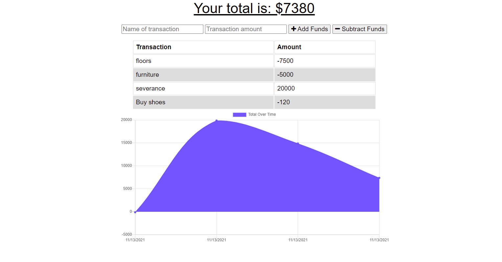

# progressive-budget

## Description

This is a simple budget tracking application that lets users add funds and subtract expenses. The main purpose of the app is to showcase an example of a Progressive Web App with data persistence. What this means is that this app can be downloaded as an application that can work outside the browser. It also can keep saving user data locally using the indexedDB browser API when the app is offline, and sync it back up to the MongoDB database when coming back online. This is all possible by creating a service worker script.
## User Story

AS AN avid traveller
I WANT to be able to track my withdrawals and deposits with or without a data/internet connection
SO THAT my account balance is accurate when I am traveling
## Acceptance Criteria
GIVEN a user is on Budget App without an internet connection
WHEN the user inputs a withdrawal or deposit
THEN that will be shown on the page, and added to their transaction history when their connection is back online.

## Installation 

If cloning to personal machine, open repository in terminal and confirm you're within the root folder. From there, run npm install to install all modules listed within the package.json file.

## Technologies 

* HTML5 and CSS
* Javascript
* Express
* Node 
* MongoDB and Mongoose

## Contributions
Tammy Gagliano
* GitHub: https://github.com/TammyGagliano/progressive-budget
* Heroku: https://tg-progressive-budget.herokuapp.com/

## Screenshot 

